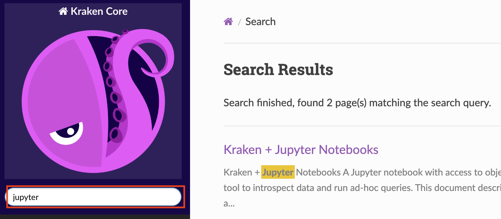

Daniel Roy Greenfeld

<!--
----

# Daniel Roy Greenfeld

aka "pydanny"

- Coder
- Employment
  - Kraken Tech
  - Startups
  - NASA & other US government agencies

----

# Coding

- co-author of Two Scoops of Django
- open source
  - co-maintainter of Cookiecutter
  - cookiecutter-django
  - djangopackages.org
  - django-crispy-forms

----

# [fit] [kraken.tech](http://kraken.tech/)

- Developer foundation team
- Spawning Ground project

-->

----

## [fit] My Mission Today

---

## [fit] My Mission Today

<br><br><br>

# [fit] Stop using [django-extensions shell-plus]() directly

---

## [fit] My Mission Today

<br><br><br>

# [fit] Convince you to use [dj-notebook]() 

----

## [fit] The problem with

<br>

# [fit] [django-extensions shell-plus]()

----

# [fit] When you exit the shell

# [fit] you lose the "session"

----

# [fit] I'm going to teach 

# [fit] how to save "sessions"

# [fit] when using shell_plus

----

### Terminal shell_plus vs Jupyter Notebooks

# [fit] Unlike the REPL

# [fit][Jupyter notebooks]()

# [fit] preserves full code order!

----
<br><br>

# [fit] However

----

<br><br><br><br>

# [fit] Django + Jupyter is hard

----

# [fit] This is notoriously brittle:

<br><br>

# [fit] `./manage.py shell_plus --notebook`

----

# [fit] This is web-based

<br><br>

# [fit] `./manage.py shell_plus --notebook`

----

# Coding in desktop tools < coding in browsers

1. Keybindings are garanteed to be what you want them to be
2. Search behaves the way you want
3. Use all the plugins you've installed

Use the tools you want, not the tools you are forced to use


----

### [fit] [dj-notebook]() is a

# [fit] wrapper 

### [fit] around [shell_plus]()

----

#### [fit] Makes running the combo

#### [fit] [Django]() + [shell_plus]() + [Jupyter]()

#### [fit] notebook trivial and stable

```python
# demo.ipynb
from dj_notebook import activate
plus = activate()
```

----

#### [fit] Kraken version

```python
# src/demo.ipynb
from localdev.notebooks.setup_jupyter import activate
plus = activate()
```

----

### [fit] Works everywhere

- VSCode
- PyCharm
- Emacs
- Vim
- Web (ugh)

Anywhere where Jupyter notebooks can be run

----

## [fit] Lots of features

----

## [fit] Rather than tell you

<br><br>

## [fit] about the features

----

<br><br><br>

# [fit] I'm going to show you

----

<br><br><br>

# [fit] [DEMO TIME]()

----

# [fit] Where is it documented?



[docs.kraken.guide/kraken-core/master/](https://docs.kraken.guide/kraken-core/master/)


----

# [fit] Call to Action

<br><br>

# [fit] Contribute to dj-notebook!

----

# [fit] Improving Model Graphs

Challenges:

1. Publishing the whole graph produces an unusable document (even using Graphviz)
2. We've hit the limits of mermaidjs, so even subsets of models don't work well

----

# [fit] Plan to improve model graphs

1. Use Charlie Denton's schema_graph to limit the size of the graph
2. Use Jupyter anywidget + vuewflow display the data

----

# [fit] Questions?

[docs.kraken.guide/kraken-core/master](https://docs.kraken.guide/kraken-core/master/)

[github.com/pydanny/dj-notebook]()