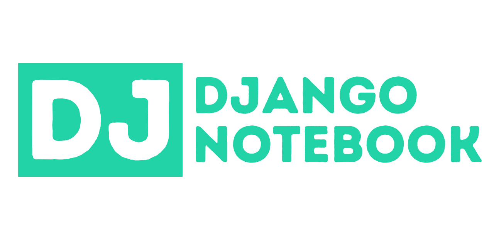

Daniel Roy Greenfeld

----

# Daniel Roy Greenfeld

aka "pydanny"

- Coder
- Employment
  - Kraken Tech
  - Startups
  - NASA & other US government agencies

----

# Coding

- co-author of Two Scoops of Django
- open source
  - co-maintainter of Cookiecutter
  - cookiecutter-django
  - djangopackages.org
  - django-crispy-forms

----

# [fit] [kraken.tech](http://kraken.tech/)

Come and work with me to help save the planet

----

# [fit] Hello Paris! 🇫🇷

My first time here!

----

# [fit] Hello Paris! 🇫🇷

I came all the way here from London

to tell you about [dj-notebook]()

----

# [fit] Hello Paris! 🇫🇷

Yes, I'm struggling through

- delicious food 🍲
- delightful wine 🍷
- incredible history 🏰
- world-class art 🎨

to tell you about [dj-notebook]()

----

## [fit] My Mission Today

Convince you to use [dj-notebook]() 

and 

stop using [django-extensions shell-plus]() directly

----

### [fit] [dj-notebook]() is a

# [fit] wrapper 

### [fit] around [shell_plus]()

----

#### [fit] Makes running django-extentions

#### [fit] in Jupyter notebook trivial

```python
# measurements.ipynb
from dj_notebook import activate
plus = activate()
```

----

### [fit] Works everywhere

- Web
- VSCode
- PyCharm
- Emacs
- Vim

Anywhere where Jupyter notebooks can be run

----

## [fit] Easy-to-extend

----

### Awesome feature

# [fit] unlike raw shell_plus

# [fit] dj-notebook

# [fit] preserves sessions!

----

## [fit] Lots more features

----

## [fit] Rather than tell you about the features

----

# I'm going to show you

----

# [fit] [DEMO TIME]()

----

# [fit] [github.com/pydanny/dj-notebook]()

<br>
<br>

Questions?