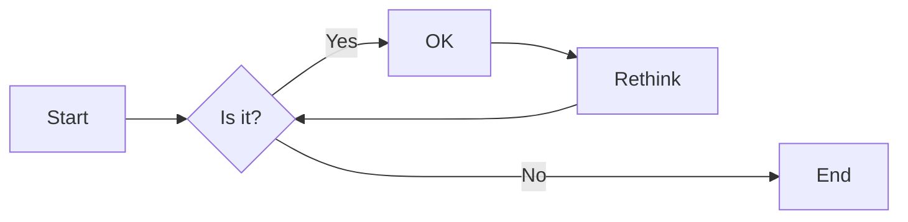
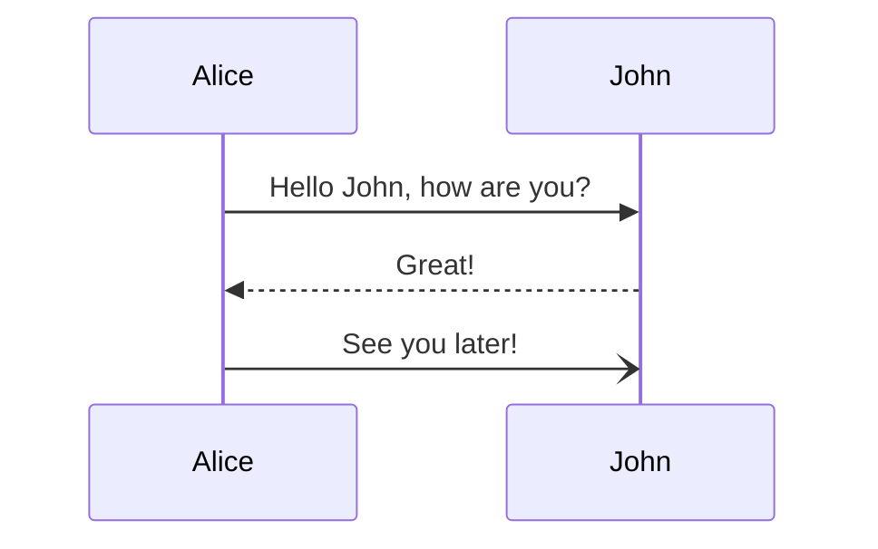
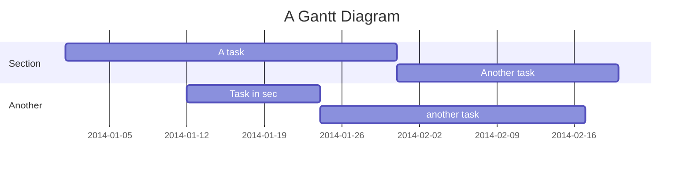

---

##  Instructions

> Best quote ever.

Press 'ESC' to toggle between slide and overview.

 <!-- .element style="border: 0; background: None; box-shadow: None" width="100px" -->

----

### Speaker notes 🗒️

Open speaker note by hitting 'S' on your keyboard.

Note: speaker notes FTW!

----

### Themes 💅

Change the [theme](https://revealjs.com/themes/) in the frontmatter!

> `black`, `moon`, `solarized`, `blood`, ...

---

## Pretty code <!-- .element data-id="code-title" -->

```js []
import React, { useState } from 'react';

function Example() {
  const [count, setCount] = useState(0);

  return (
    ...
  );
}
```
<!-- .element data-id="code-animation" -->

Code syntax highlighting courtesy of [highlight.js](https://highlightjs.org/usage/).

<!-- .slide: data-auto-animate="1" -->

----

### With animations <!-- .element data-id="code-title" -->

```js [|4,8-11|17|22-24]
import React, { useState } from 'react';

function Example() {
  const [count, setCount] = useState(0);

  return (
    <div>
      <p>You clicked {count} times</p>
      <button onClick={() => setCount(count + 1)}>
        Click me
      </button>
    </div>
  );
}

function SecondExample() {
  const [count, setCount] = useState(0);

  return (
    <div>
      <p>You clicked {count} times</p>
      <button onClick={() => setCount(count + 1)}>
        Click me
      </button>
    </div>
  );
}
```
<!-- .element data-id="code-animation" -->

<!-- .slide: data-auto-animate="1" -->

---
## Mermaid charts 🧜‍♀️

See more about Mermaid [here](https://mermaid-js.github.io/mermaid/#/).




----

### Sequence diagram



----

### Gantt


<!-- .element style="font-size: 16px;" -->

---

## Distribution
#### Print to PDF 🖨️

```shell
reveal-md slides.md --print slides.pdf --theme simple
```

#### Static Website 💻

```shell
reveal-md slides.md --static _site
```

---
## Thank you! 🎉

Find out more about reveal-md [here](https://github.com/webpro/reveal-md).

For a free Markdown-based note-taking app, check out [Notable](https://notable.app/).