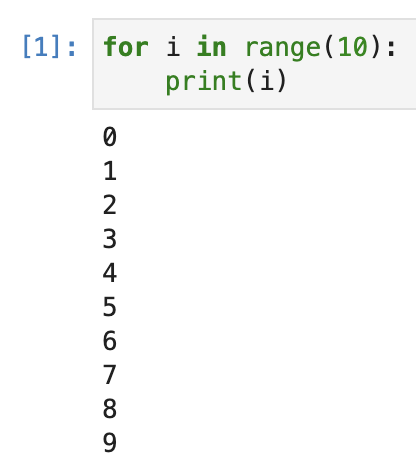
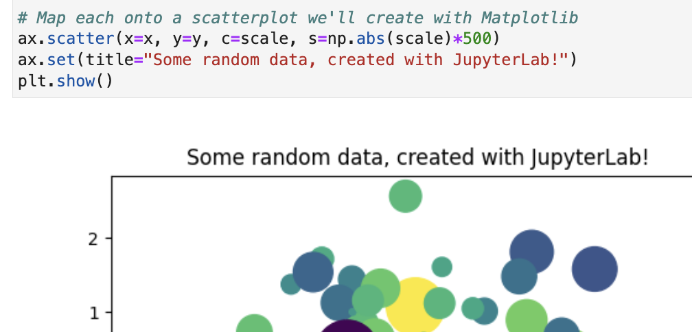
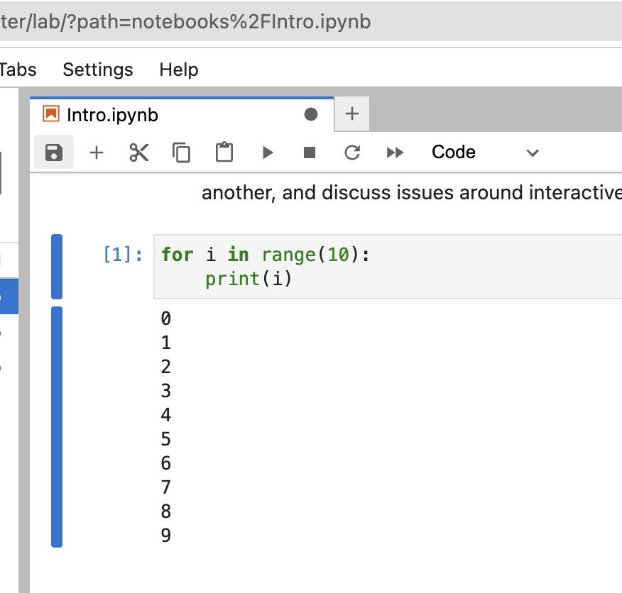
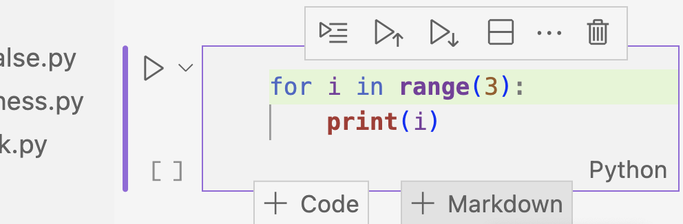

# [django](https://djangoproject.com)
# ➕
# [Jupyter](https://jupyter.org/)

The story and demo of [dj-notebook](https://github.com/pydanny/dj-notebook)

---

## Table of Contents

1. Story
2. Demo
3. Calls to action

---

# 1. Story

---

### Jupyter Notebook is a Super REPL

- Feature rich
- Unlike the REPL remembers state between sessions



---

Easy Visualizations



---

### django-extensions
## [shell_plus]()
### is awesome

- Loads models, settings, and more into Django shell
- Further enhances the shell with ipython, etc

**note: Calling it shell_plus from now on**

---

## [Django+Jupyter]()
### is wonderful

So easy! 

```sh
./manage.py shell_plus --notebook
```

All the features we want in one place!

---

# Hooray!

---

# 😭

---

# A
# few
# problems

---

## Problems with [Jupyter Notebook]()

- The web interface feels clunky
- I don't like coding in a browser



---

### Problems with shell_plus

- shell_plus tied to all the other pieces of django-extensions
- Somewhat cryptic code base
- Hard to extend outside of a limited functionality set

---

# One more problem...

---

## This never works

```sh
./manage.py shell_plus --notebook
```


---

# EVER

_I've yet to see it myself_

---

After many attempts over the years

## I gave up on [Django+Jupyter]()

---

# June 2023

---

Audrey started to use Jupyter notebook but wasn't complaining

---

## Jupyter + [VSCode]()



Nicer interface

---

#### Other Jupyter Integrations:

- PyCharm
- Vim
- Emacs

---

## Still couldn't use it with Django 

# 😭

---

# July 2023

---

### Found example in Kraken

How to run Django in Jupyter

```python
# Import does path work to load Django config
import localdev.jupyter.setup
```

---

Then I could do this:

```
from octoenergy.data.brands.models import Brand
Brand.objects.all()
```

```
<QuerySet [<Brand: Octopus Energy>,
<Brand: Two Scoops Energy>]>
```

# 😲

---

## What about django-extensions [shell_plus]()?

I want that magic shell...

---

### Dove into shell_plus

```python
# django_extensions/management/shells.py
for directive in import_directives:
    if isinstance(directive, str):
        directive = directive.strip()
    try:
        if isinstance(directive, str) and directive.startswith(("from ", "import ")):
            try:
                node = ast.parse(directive)
            except Exception as exc:
                if not quiet_load:
                    print(style.ERROR("Error parsing: %r %s" % (directive, exc)))
                    continue
            if not all(isinstance(body, (ast.Import, ast.ImportFrom)) for body in node.body):
                if not quiet_load:
                    print(style.ERROR("Only specify import statements: %r" % directive))
                continue
```

---

### Got it working!

```python
# Uses Jupyter %run magic command
%run localdev/jupyter/setup_plus.py
```

```python
# _plus object implicitly loaded
_plus.Brand.objects.all()
```

```
<QuerySet [<Brand: Octopus Energy>,
<Brand: Two Scoops Energy>]>
```

---

### Getting there took a while

- Code was one challenge
- Kraken's magnificent volume was another

---

## I
## wanted
## to move
# [faster]()

---

### I wanted to move faster

- Kraken serves 10s of millions of customers
- We have to tread carefully

---

### Desired change

Load [_plus]() explicitly rather than implicitly

---

### Instead of implicit loads

```python
# Load implicit '_plus' object
%run localdev/jupyter/setup_plus.py
```

---

### Generate variable explicitly:

```python
# Explicit import
from blarg import activate

# Explicit variable definition
plus = activate('path.to.settings')
```

---

## Let's extract the code from Kraken!

---

## Open sourcing

- Allows us to add features more quickly
- Share fun of Django+Jupyter with planet

---

### Good Fortune

Django+Jupyter is not tied to

### [Kraken's business model]()

---

# September 2023

---

## [dj-notebook]()

# 😁

## open sourced

---

## Current state:

- Easy-to-use wrapper around shell_plus
- Extra tools added that we've dreamed up

<!-- .slide: data-auto-animate="1" -->

---

## Current state:

- Easy-to-use wrapper around shell_plus
- Extra tools added that we've dreamed up
- **[LOGO!!!]()**


<!-- .slide: data-auto-animate="1" -->

---

# 2. Demo

_Secret mission: convince people to use [dj-notebook]() instead of shell_plus_

---

# 3. Calls to action 

---

# Try
## [dj-notebook]()

- Opinions
- Tricks
- Bugs
- Features

---

[github.com/pydanny/dj-notebook](https://github.com/pydanny/dj-notebook)

[dj-notebook.readthedocs.io](https://dj-notebook.readthedocs.io)

---

## Help us fight climate change

---

### [octopus.energy/careers](https://octopus.energy/careers)

---

[](https://github.com/pydanny/dj-notebook)

[github.com/pydanny/dj-notebook](https://github.com/pydanny/dj-notebook)